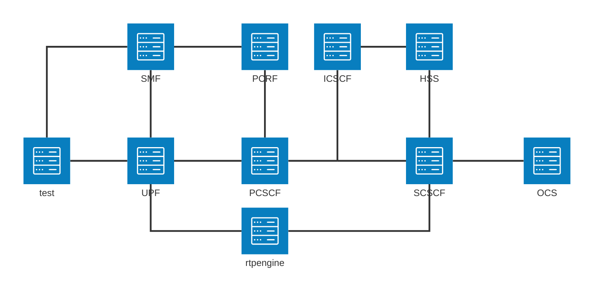

# IMS
IP Multimedia Subsystem

Why the setup is needed:
- provide entirely software based playground for testing
- delve a bit deeper into the Kamailio configuration documenting the process
- make simple and clean solution utilizing compose features like interpolation
- create helm charts for Kubernetes installation

## How to use
As the setup loads and uses kernel module, best to test in VM

    docker compose --profile test up -d

For always up to date commands, check out [CI](.github/workflows/compose.yml) configuration

To observe the packets

    wireshark -i any --display-filter 'gtpv2 or sip or diameter.cmd.code != 280'

## Specifications
- SIP [RFC 3261](https://www.rfc-editor.org/rfc/rfc3261.html)
- SDP [RFC 8866](https://www.rfc-editor.org/rfc/rfc8866.html)
- RTP [RFC 1889](https://www.rfc-editor.org/rfc/rfc1889.html)
- IMS
  - [TS 23.228](https://www.etsi.org/deliver/etsi_ts/123200_123299/123228/18.07.00_60/ts_123228v180700p.pdf)
  - [TS 24.229](https://www.etsi.org/deliver/etsi_ts/124200_124299/124229/18.06.00_60/ts_124229v180600p.pdf)
- Diameter Cx / SBA N70 [TS 29.562](https://www.etsi.org/deliver/etsi_ts/129500_129599/129562/18.06.00_60/ts_129562v180600p.pdf)
  - [TS 29.228](https://www.etsi.org/deliver/etsi_ts/129200_129299/129228/18.00.00_60/ts_129228v180000p.pdf)
  - [TS 29.229](https://www.etsi.org/deliver/etsi_ts/129200_129299/129229/18.01.00_60/ts_129229v180100p.pdf)
- Diameter Rx [TS 29.214](https://www.etsi.org/deliver/etsi_ts/129200_129299/129214/18.03.00_60/ts_129214v180300p.pdf) / SBA N5 [TS 29.514](https://www.etsi.org/deliver/etsi_ts/129500_129599/129514/18.08.00_60/ts_129514v180800p.pdf)
- Diameter Ro/Rf
  - [RFC 8506](https://www.rfc-editor.org/rfc/rfc8506.html)
  - [TS 32.299](https://www.etsi.org/deliver/etsi_ts/132200_132299/132299/18.00.00_60/ts_132299v180000p.pdf)
- SMS [TS 24.341](https://www.etsi.org/deliver/etsi_ts/124300_124399/124341/18.00.00_60/ts_124341v180000p.pdf)
- Emergency [TS 23.167](https://www.etsi.org/deliver/etsi_ts/123100_123199/123167/18.02.00_60/ts_123167v180200p.pdf)

## Flows
- [Registration](doc/registration.md)
- [Session Control](doc/session.md)
- [Transaction](doc/transaction.md)

## Components
- IMS (compose.yml)
  - [x] [CSCF](doc/images.md#kamailio-p-cscfi-cscfs-cscf)
    - [x] Proxy
    - [x] Interrogating
    - [x] Serving
  - [x] [DB](doc/images.md#ims-db)
  - [x] [rtpengine](doc/images.md#rtpengine)
  - [x] [DNS](doc/images.md#coredns)
- Core Network (core.yml)
  - [x] [DRA](doc/images.md#freediameter-dra)
  - [x] [HSS](doc/images.md#open5gs-hsspcrfpgw)
  - [x] HSS UI
  - [x] [PCRF](doc/images.md#open5gs-hsspcrfpgw)
  - [x] PGW (CUPS)
    - [x] [SMF](doc/images.md#open5gs-hsspcrfpgw)
    - [x] [UPF](doc/images.md#open5gs-hsspcrfpgw)
  - [ ] SMSC
  - [x] MongoDB
- Billing (billing.yml)
  - [x] [OCS](doc/images.md#cgrates-billing)
- Monitoring (monitor.yml)
  - [x] Promtail
  - [x] Loki
  - [x] cAdvisor
  - [x] Prometheus
  - [ ] Alertmanager
  - [x] Grafana
- Testing (compose.yml)
  - [x] Doubango
