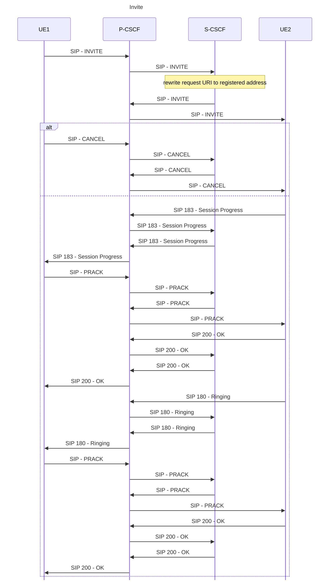

```mermaid
---
title: Invite
config:
  mirrorActors: false
---
sequenceDiagram
    UE1->>P-CSCF: SIP - INVITE
    P-CSCF->>S-CSCF: SIP - INVITE
    Note over S-CSCF: rewrite request URI to registered address
    S-CSCF->>P-CSCF: SIP - INVITE
    P-CSCF->>UE2: SIP - INVITE
    alt
        UE1->>P-CSCF: SIP - CANCEL
        P-CSCF->>S-CSCF: SIP - CANCEL
        S-CSCF->>P-CSCF: SIP - CANCEL
        P-CSCF->>UE2: SIP - CANCEL
    else
        UE2->>P-CSCF: SIP 183 - Session Progress
        P-CSCF->>S-CSCF: SIP 183 - Session Progress
        S-CSCF->>P-CSCF: SIP 183 - Session Progress
        P-CSCF->>UE1: SIP 183 - Session Progress
        UE1->>P-CSCF: SIP - PRACK
        P-CSCF->>S-CSCF: SIP - PRACK
        S-CSCF->>P-CSCF: SIP - PRACK
        P-CSCF->>UE2: SIP - PRACK
        UE2->>P-CSCF: SIP 200 - OK
        P-CSCF->>S-CSCF: SIP 200 - OK
        S-CSCF->>P-CSCF: SIP 200 - OK
        P-CSCF->>UE1: SIP 200 - OK
        UE2->>P-CSCF: SIP 180 - Ringing
        P-CSCF->>S-CSCF: SIP 180 - Ringing
        S-CSCF->>P-CSCF: SIP 180 - Ringing
        P-CSCF->>UE1: SIP 180 - Ringing
        UE1->>P-CSCF: SIP - PRACK
        P-CSCF->>S-CSCF: SIP - PRACK
        S-CSCF->>P-CSCF: SIP - PRACK
        P-CSCF->>UE2: SIP - PRACK
        UE2->>P-CSCF: SIP 200 - OK
        P-CSCF->>S-CSCF: SIP 200 - OK
        S-CSCF->>P-CSCF: SIP 200 - OK
        P-CSCF->>UE1: SIP 200 - OK
    end
```
