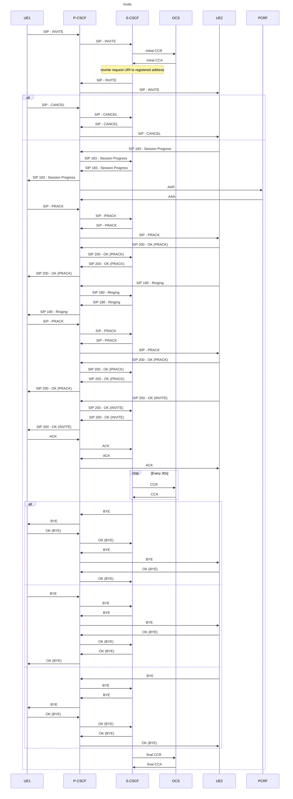

```mermaid
---
title: Invite
---
sequenceDiagram
    UE1->>P-CSCF: SIP - INVITE
    P-CSCF->>S-CSCF: SIP - INVITE
    S-CSCF->>OCS: initial CCR
    OCS->>S-CSCF: initial CCA
    Note over S-CSCF: rewrite request URI to registered address
    S-CSCF->>P-CSCF: SIP - INVITE
    P-CSCF->>UE2: SIP - INVITE
    alt
        UE1->>P-CSCF: SIP - CANCEL
        P-CSCF->>S-CSCF: SIP - CANCEL
        S-CSCF->>P-CSCF: SIP - CANCEL
        P-CSCF->>UE2: SIP - CANCEL
    else
        UE2->>P-CSCF: SIP 183 - Session Progress
        P-CSCF->>S-CSCF: SIP 183 - Session Progress
        S-CSCF->>P-CSCF: SIP 183 - Session Progress
        P-CSCF->>UE1: SIP 183 - Session Progress
        P-CSCF->>PCRF: AAR
        PCRF->>P-CSCF: AAA
        UE1->>P-CSCF: SIP - PRACK
        P-CSCF->>S-CSCF: SIP - PRACK
        S-CSCF->>P-CSCF: SIP - PRACK
        P-CSCF->>UE2: SIP - PRACK
        UE2->>P-CSCF: SIP 200 - OK (PRACK)
        P-CSCF->>S-CSCF: SIP 200 - OK (PRACK)
        S-CSCF->>P-CSCF: SIP 200 - OK (PRACK)
        P-CSCF->>UE1: SIP 200 - OK (PRACK)

        UE2->>P-CSCF: SIP 180 - Ringing
        P-CSCF->>S-CSCF: SIP 180 - Ringing
        S-CSCF->>P-CSCF: SIP 180 - Ringing
        P-CSCF->>UE1: SIP 180 - Ringing
        UE1->>P-CSCF: SIP - PRACK
        P-CSCF->>S-CSCF: SIP - PRACK
        S-CSCF->>P-CSCF: SIP - PRACK
        P-CSCF->>UE2: SIP - PRACK
        UE2->>P-CSCF: SIP 200 - OK (PRACK)
        P-CSCF->>S-CSCF: SIP 200 - OK (PRACK)
        S-CSCF->>P-CSCF: SIP 200 - OK (PRACK)
        P-CSCF->>UE1: SIP 200 - OK (PRACK)

        UE2->>P-CSCF: SIP 200 - OK (INVITE)
        P-CSCF->>S-CSCF: SIP 200 - OK (INVITE)
        S-CSCF->>P-CSCF: SIP 200 - OK (INVITE)
        P-CSCF->>UE1: SIP 200 - OK (INVITE)
        UE1->>P-CSCF: ACK
        P-CSCF->>S-CSCF: ACK
        S-CSCF->>P-CSCF: ACK
        P-CSCF->>UE2: ACK

        loop Every 30s
            S-CSCF->>OCS: CCR
            OCS->>S-CSCF: CCA
        end

        alt
            S-CSCF->>P-CSCF: BYE
            P-CSCF->>UE1: BYE
            UE1->>P-CSCF: OK (BYE)
            P-CSCF->>S-CSCF: OK (BYE)
            S-CSCF->>P-CSCF: BYE
            P-CSCF->>UE2: BYE
            UE2->>P-CSCF: OK (BYE)
            P-CSCF->>S-CSCF: OK (BYE)
        else
            UE1->>P-CSCF: BYE
            P-CSCF->>S-CSCF: BYE
            S-CSCF->>P-CSCF: BYE
            P-CSCF->>UE2: BYE
            UE2->>P-CSCF: OK (BYE)
            P-CSCF->>S-CSCF: OK (BYE)
            S-CSCF->>P-CSCF: OK (BYE)
            P-CSCF->>UE1: OK (BYE)
        else
            UE2->>P-CSCF: BYE
            P-CSCF->>S-CSCF: BYE
            S-CSCF->>P-CSCF: BYE
            P-CSCF->>UE1: BYE
            UE1->>P-CSCF: OK (BYE)
            P-CSCF->>S-CSCF: OK (BYE)
            S-CSCF->>P-CSCF: OK (BYE)
            P-CSCF->>UE2: OK (BYE)
        end
        S-CSCF->>OCS: final CCR
        OCS->>S-CSCF: final CCA
    end
```
