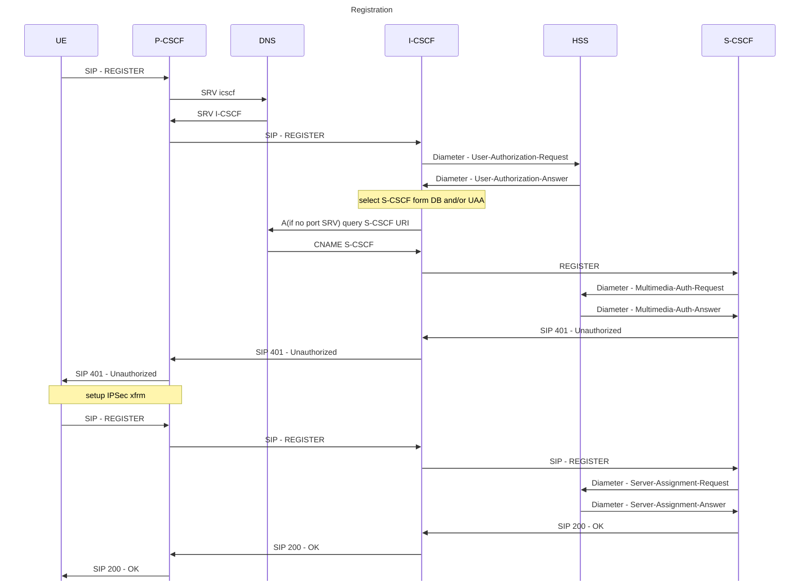
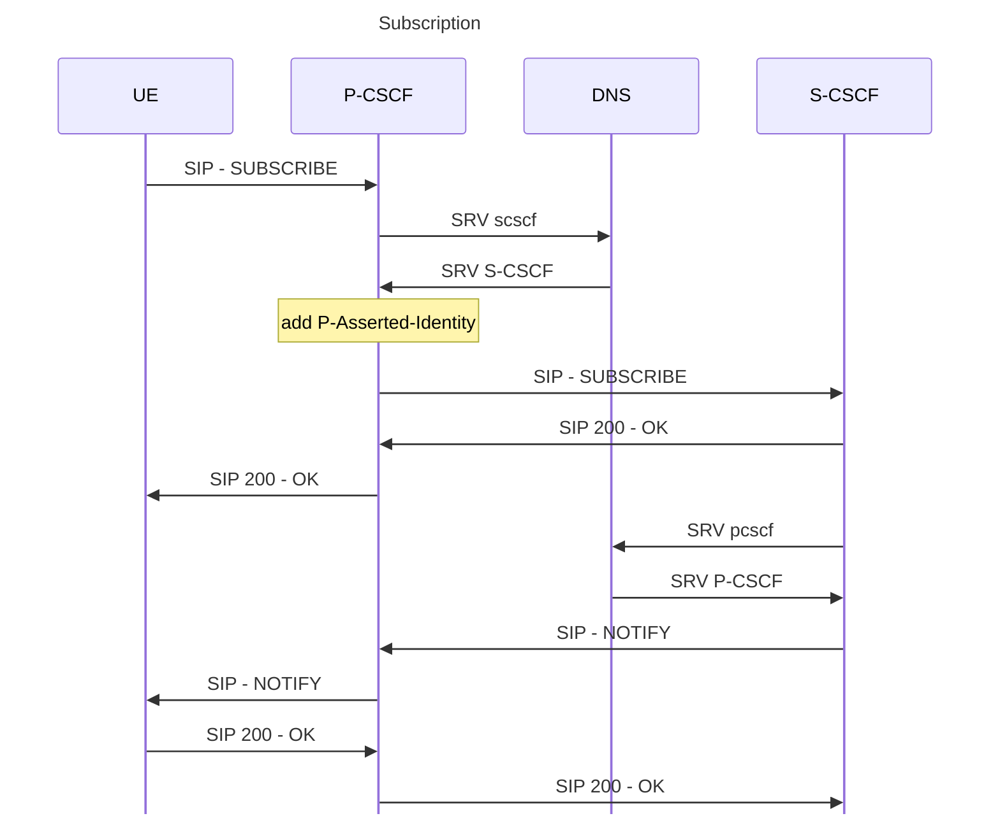

Right after registration, the UE sends SUSCRIBE for Event: reg. The purpose of this subscription is to allow, if necessary, network initiated deregistration as described by TS 23.228, 5.3.2, as the SIP does not have DEREGISTER message per se.
When the network want to deregister subscriber, it sends NOTIFY with XML body reginfo>registration params: state="terminated" >contact with params: event="unregistered" and state="terminated" as per RFC 3680, Section 5.

