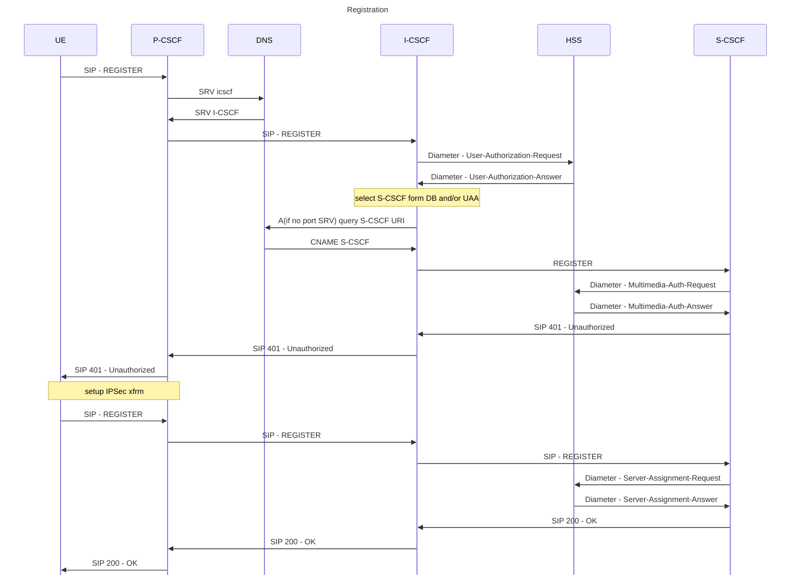
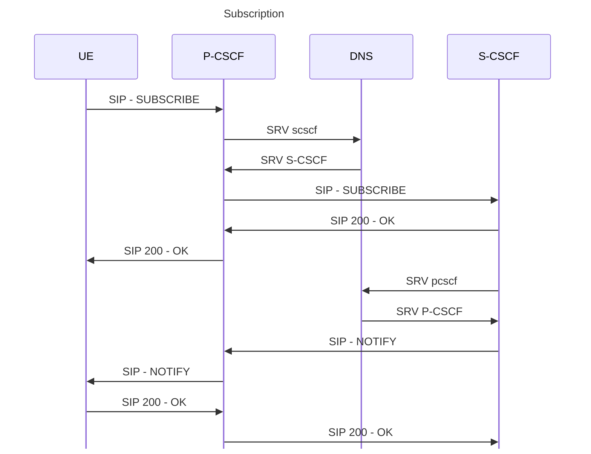

```mermaid
---
title: Registration
config:
  mirrorActors: false
---
sequenceDiagram
    UE->>P-CSCF: SIP - REGISTER
    P-CSCF->>DNS: SRV icscf
    DNS->>P-CSCF: SRV I-CSCF
    P-CSCF->>I-CSCF: SIP - REGISTER
    I-CSCF->>HSS: Diameter - User-Authorization-Request
    HSS->>I-CSCF: Diameter - User-Authorization-Answer
    Note over I-CSCF: select S-CSCF form DB and/or UAA
    I-CSCF->>DNS: A(if no port SRV) query S-CSCF URI
    DNS->>I-CSCF: CNAME S-CSCF
    I-CSCF->>S-CSCF: REGISTER
    S-CSCF->>HSS: Diameter - Multimedia-Auth-Request
    HSS->>S-CSCF: Diameter - Multimedia-Auth-Answer
    S-CSCF->>I-CSCF: SIP 401 - Unauthorized
    I-CSCF->>P-CSCF: SIP 401 - Unauthorized
    P-CSCF->>UE: SIP 401 - Unauthorized
    Note over UE,P-CSCF: setup IPSec xfrm
    UE->>P-CSCF: SIP - REGISTER
    P-CSCF->>I-CSCF: SIP - REGISTER
    I-CSCF->>S-CSCF: SIP - REGISTER
    S-CSCF->>HSS: Diameter - Server-Assignment-Request
    HSS->>S-CSCF: Diameter - Server-Assignment-Answer
    S-CSCF->>I-CSCF: SIP 200 - OK
    I-CSCF->>P-CSCF: SIP 200 - OK
    P-CSCF->>UE: SIP 200 - OK
```

```mermaid
---
title: Subscription
config:
  mirrorActors: false
---
sequenceDiagram
    UE->>P-CSCF: SIP - SUBSCRIBE
    P-CSCF->>DNS: SRV scscf
    DNS->>P-CSCF: SRV S-CSCF
    P-CSCF->>S-CSCF: SIP - SUBSCRIBE
    S-CSCF->>P-CSCF: SIP 200 - OK
    P-CSCF->>UE: SIP 200 - OK
    S-CSCF->>DNS: SRV pcscf
    DNS->>S-CSCF: SRV P-CSCF
    S-CSCF->>P-CSCF: SIP - NOTIFY
    P-CSCF->>UE: SIP - NOTIFY
    UE->>P-CSCF: SIP 200 - OK
    P-CSCF->>S-CSCF: SIP 200 - OK
```

