```mermaid
---
title: Session Control
---
sequenceDiagram
    UE1->>P-CSCF: SIP - INVITE
    P-CSCF->>PCRF: Diameter - AA-Request (AAR)
    PCRF->>P-CSCF: Diameter - AA-Answer (AAA)
    P-CSCF->>S-CSCF: SIP - INVITE
    S-CSCF->>OCS: Diameter - initial orig Credit-Control-Request (CCR)
    OCS->>S-CSCF: Diameter - initial orig Credit-Control-Answer (CCA)
    Note over S-CSCF: TS 23.228 5.5.2<br>The Serving-CSCF handling session origination performs an analysis of the destination address<br>and forwards the request to the Interrogating-CSCF for the terminating user.<br>It could be local I-CSCF, if a subscriber of the same operator, or<br>I-CSCF entry point of other operator.
    S-CSCF->>I-CSCF: SIP - INVITE
    I-CSCF->>HSS: Diameter - Location-Info-Request (LIR)
    HSS->>I-CSCF: Diameter - Location-Info-Answer (LIA)
    I-CSCF->>S-CSCF: SIP - INVITE
    S-CSCF->>OCS: Diameter - initial term Credit-Control-Request (CCR)
    OCS->>S-CSCF: Diameter - initial term Credit-Control-Answer (CCA)
    S-CSCF->>P-CSCF: SIP - INVITE
    P-CSCF->>UE2: SIP - INVITE
    alt
        UE1->>P-CSCF: SIP - CANCEL
        P-CSCF->>S-CSCF: SIP - CANCEL
        S-CSCF->>I-CSCF: SIP - CANCEL
        I-CSCF->>S-CSCF: SIP - CANCEL
        S-CSCF->>P-CSCF: SIP - CANCEL
        P-CSCF->>UE2: SIP - CANCEL
    else
        opt precondition
            UE2->>P-CSCF: SIP 183 - Session Progress
            P-CSCF->>S-CSCF: SIP 183 - Session Progress
            S-CSCF->>I-CSCF: SIP 183 - Session Progress
            I-CSCF->>S-CSCF: SIP 183 - Session Progress
            S-CSCF->>P-CSCF: SIP 183 - Session Progress
            P-CSCF->>UE1: SIP 183 - Session Progress
            opt 100rel
                UE1->>P-CSCF: SIP - PRACK
                P-CSCF->>S-CSCF: SIP - PRACK
                S-CSCF->>I-CSCF: SIP - PRACK
                I-CSCF->>S-CSCF: SIP - PRACK
                S-CSCF->>P-CSCF: SIP - PRACK
                P-CSCF->>UE2: SIP - PRACK
                UE2->>P-CSCF: SIP 200 - OK (PRACK)
                P-CSCF->>S-CSCF: SIP 200 - OK (PRACK)
                S-CSCF->>I-CSCF: SIP 200 - OK (PRACK)
                I-CSCF->>S-CSCF: SIP 200 - OK (PRACK)
                S-CSCF->>P-CSCF: SIP 200 - OK (PRACK)
                P-CSCF->>UE1: SIP 200 - OK (PRACK)
            end
        end

        UE2->>P-CSCF: SIP 180 - Ringing
        P-CSCF->>S-CSCF: SIP 180 - Ringing
        S-CSCF->>I-CSCF: SIP 180 - Ringing
        I-CSCF->>S-CSCF: SIP 180 - Ringing
        S-CSCF->>P-CSCF: SIP 180 - Ringing
        P-CSCF->>UE1: SIP 180 - Ringing
        opt 100rel
            UE1->>P-CSCF: SIP - PRACK
            P-CSCF->>S-CSCF: SIP - PRACK
            S-CSCF->>I-CSCF: SIP - PRACK
            I-CSCF->>S-CSCF: SIP - PRACK
            S-CSCF->>P-CSCF: SIP - PRACK
            P-CSCF->>UE2: SIP - PRACK
            UE2->>P-CSCF: SIP 200 - OK (PRACK)
            P-CSCF->>S-CSCF: SIP 200 - OK (PRACK)
            S-CSCF->>I-CSCF: SIP 200 - OK (PRACK)
            I-CSCF->>S-CSCF: SIP 200 - OK (PRACK)
            S-CSCF->>P-CSCF: SIP 200 - OK (PRACK)
            P-CSCF->>UE1: SIP 200 - OK (PRACK)
        end

        UE2->>P-CSCF: SIP 200 - OK (INVITE)
        P-CSCF->>PCRF: Diameter - AA-Request (AAR)
        PCRF->>P-CSCF: Diameter - AA-Answer (AAA)
        P-CSCF->>S-CSCF: SIP 200 - OK (INVITE)
        S-CSCF->>I-CSCF: SIP 200 - OK (INVITE)
        I-CSCF->>S-CSCF: SIP 200 - OK (INVITE)
        S-CSCF->>P-CSCF: SIP 200 - OK (INVITE)
        P-CSCF->>UE1: SIP 200 - OK (INVITE)

        UE1->>P-CSCF: SIP - ACK
        P-CSCF->>S-CSCF: SIP - ACK
        S-CSCF->>I-CSCF: SIP - ACK
        I-CSCF->>S-CSCF: SIP - ACK
        S-CSCF->>P-CSCF: SIP - ACK
        P-CSCF->>UE2: SIP - ACK
        UE2->>P-CSCF: SIP 200 - OK (ACK)
        P-CSCF->>S-CSCF: SIP 200 - OK (ACK)
        S-CSCF->>I-CSCF: SIP 200 - OK (ACK)
        I-CSCF->>S-CSCF: SIP 200 - OK (ACK)
        S-CSCF->>P-CSCF: SIP 200 - OK (ACK)
        P-CSCF->>UE1: SIP 200 - OK (ACK)

        loop Every 30s
            S-CSCF->>OCS: Diameter - Credit-Control-Request (CCR)
            OCS->>S-CSCF: Diameter - Credit-Control-Answer (CCA)
        end

        alt
            S-CSCF->>P-CSCF: BYE
            P-CSCF->>PCRF: Diameter - Session-Termination-Request (STR)
            PCRF->>P-CSCF: Diameter - Session-Termination-Answer (STA)
            P-CSCF->>UE1: BYE
            UE1->>P-CSCF: OK (BYE)
            P-CSCF->>S-CSCF: OK (BYE)
            S-CSCF->>P-CSCF: BYE
            P-CSCF->>PCRF: Diameter - Session-Termination-Request (STR)
            PCRF->>P-CSCF: Diameter - Session-Termination-Answer (STA)
            P-CSCF->>UE2: BYE
            UE2->>P-CSCF: OK (BYE)
            P-CSCF->>S-CSCF: OK (BYE)
        else
            UE1->>P-CSCF: BYE
            P-CSCF->>PCRF: Diameter - Session-Termination-Request (STR)
            PCRF->>P-CSCF: Diameter - Session-Termination-Answer (STA)
            P-CSCF->>S-CSCF: BYE
            S-CSCF->>P-CSCF: BYE
            P-CSCF->>UE2: BYE
            UE2->>P-CSCF: OK (BYE)
            P-CSCF->>PCRF: Diameter - Session-Termination-Request (STR)
            PCRF->>P-CSCF: Diameter - Session-Termination-Answer (STA)
            P-CSCF->>S-CSCF: OK (BYE)
            S-CSCF->>P-CSCF: OK (BYE)
            P-CSCF->>UE1: OK (BYE)
        else
            UE2->>P-CSCF: BYE
            P-CSCF->>PCRF: Diameter - Session-Termination-Request (STR)
            PCRF->>P-CSCF: Diameter - Session-Termination-Answer (STA)
            P-CSCF->>S-CSCF: BYE
            S-CSCF->>P-CSCF: BYE
            P-CSCF->>UE1: BYE
            P-CSCF->>PCRF: Diameter - Session-Termination-Request (STR)
            PCRF->>P-CSCF: Diameter - Session-Termination-Answer (STA)
            UE1->>P-CSCF: OK (BYE)
            P-CSCF->>S-CSCF: OK (BYE)
            S-CSCF->>P-CSCF: OK (BYE)
            P-CSCF->>UE2: OK (BYE)
        end
        S-CSCF->>OCS: Diameter - final Credit-Control-Request (CCR)
        OCS->>S-CSCF: Diameter - final Credit-Control-Answer (CCA)
    end
```

### precondition [RFC 3312](https://www.rfc-editor.org/rfc/rfc3312.html)
SIP:
```
Require: precondition
```
or
```
Supported: precondition
```
SDP:
```
a=des:qos mandatory local sendrecv
a=curr:qos local none
a=des:qos optional remote sendrecv
a=curr:qos remote none
```


### Questions:
- What analysis does the S-CSCF perform to determine and discover the correct I-CSCF
  when forwarding requests?
- How the OCS distinguishes originating from terminating Credit-Control-Request (CCR)?
